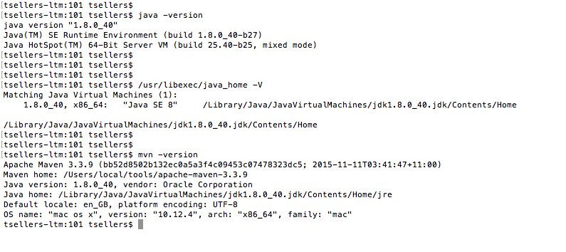
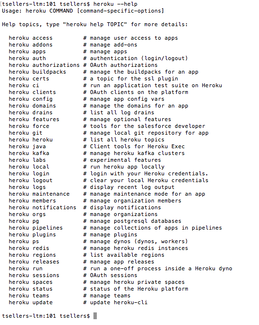
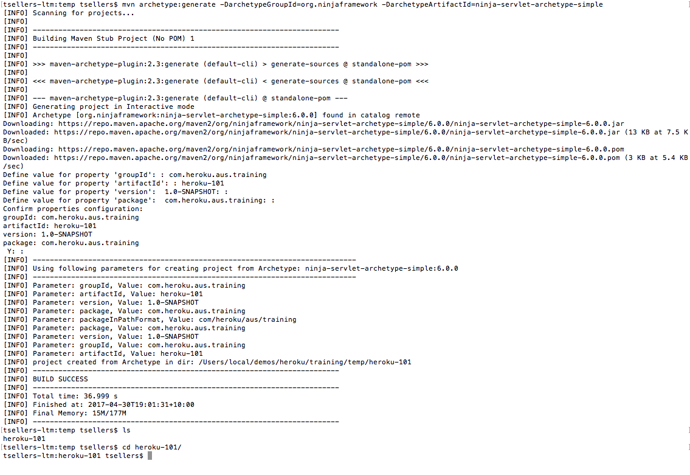
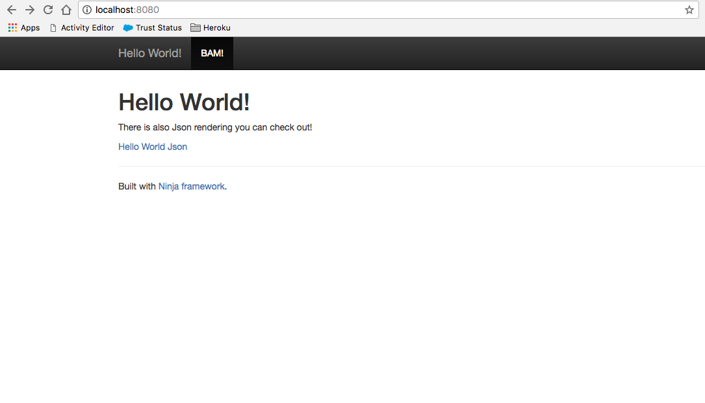
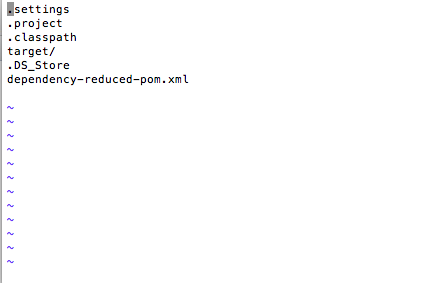
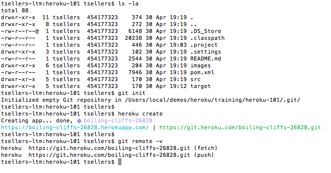
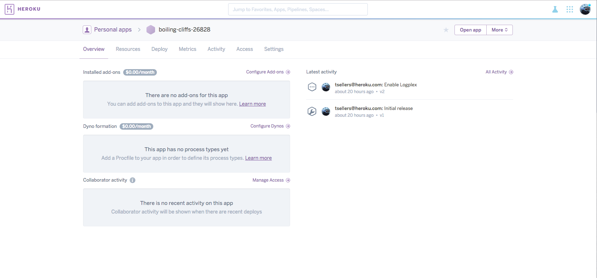

[Heroku 101](https://github.com/ibigfoot/heroku-101) | [Heroku 201](https://github.com/ibigfoot/heroku-201/tree/java) | [Heroku 301](https://github.com/ibigfoot/heroku-301tree/java) | [Heroku 401](https://github.com/ibigfoot/heroku-401tree/java)

# Heroku 101

Creating your first Java on Heroku application is pretty simple, but you will need a few things installed before we get started.


## Prerequisites 
So, for the code in this sample to work you will want to have [Java 8](http://www.oracle.com/technetwork/java/javase/downloads/index.html) and [Maven 3](https://maven.apache.org/install.html) installed on your local machine. I also use [Eclipse](https://eclipse.org/downloads/eclipse-packages/?show_instructions=TRUE) but there are no specific eclipse tools or plugins that we need for this so feel free to use your IDE of choice. 

First, see what version of java you are running

```
> java -version
```
Or, if you would prefer to see where your JDK is 
```
> /usr/libexec/java_home -V
```

Similarly, you should be able to execute your version of Maven 
```
> mvn -version
```

Your output should be something similar to this



Lastly, if you haven't got yourself a [Github](https://github.com) account, you will want to sign up as by the end of the day we are going to be deploying our applications directly from Github!

## Heroku CLI
Next, you will definitely want the [Heroku CLI](https://devcenter.heroku.com/articles/using-the-cli) installed.
Go to the [Getting Started with Java](https://devcenter.heroku.com/articles/getting-started-with-java#set-up) setup page and download the Heroku CLI for your environment. 

You will know you have it right when you can run the heroku --help command and see this.



## Create a Java Application
Lets get started with writing some code. Today we are going to build and deploy a Ninja Web Application onto our Heroku service. 
[Ninja](http://www.ninjaframework.org/high_level_overview.html) is pretty easy to get started with, includes a bunch of stuff including dependency management, i18n and other wonderful bits right out of the box. If you have a preference (maybe [Spark](http://sparkjava.com/) is your thing?) or you like the idea of Spring Boot, feel free to continue with the Heroku Dev Center getting started [article](https://devcenter.heroku.com/articles/getting-started-with-java). 

For this excercise, let's start from scratch with Ninja...

```
> mvn archetype:generate -DarchetypeGroupId=org.ninjaframework -DarchetypeArtifactId=ninja-servlet-archetype-simple
```



You should now have a skeleton Ninja Web framework.. 

```
> cd heroku-101  #or whatever you called yours
```
```
> mvn eclipse:eclipse
```

Now, to start in your local environment it is very simple
```
> mvn clean package
> mvn ninja:run
```



Cool, lets get this guy running in Heroku now! 

## Create an Heroku App

So the first thing we need to do is initialise our Git repository, Heroku makes [heavy use](https://devcenter.heroku.com/articles/git) of the [Git](https://git-scm.com/) version control system for deployment. If you are not familiar with Git and the process for handling code using it I would recommend something like this [cheat sheet](https://www.cloudways.com/blog/git-cheat-sheet/) to get you started. 

Firstly, let's create a git repository out of our codebase. 

```
> git init
> git status
```

This should list all the files that need to be added to your git repository. One thing to note, is there are files in here that don't belong in source control. You might have eclips project files for example, your Maven target directory and perhaps the OS X .DS_Store file. Lets add a .gitignore and make sure our repository remains clean. (Below I use the VI editor, but that is just a personal choice.. you can use any text editor to create the file called .gitignore)

```
> vi .gitignore
```

Then simple add an entry per line for things you want to keep out of source control, like this.



Now we can add files to our git repository and commit. 

```
> git add .
> git commit -am "initial commit"
```

If you are yet to authenticate to the Heroku CLI, lets do that first

```
> heroku login
```

Then, to create your Heroku application the command you need to get started is just one.. 
```
> heroku create -t korea-training
```

Have a look at this output to get an idea of just what is happening..



You should see that Heroku has added a git remote to your local codebase. You will see in mine I have been allocated the application name "boiling-cliffs-26828", you can see this application in your [Heroku Dashboard](https://dashboard.heroku.com). Open this and find your app, it will look pretty empty at the moment as we haven't pushed any code or configure our codebase to run on Heroku. 



## Getting our App to Run - The Procfile and some Maven Fixes

The [Procfile](https://devcenter.heroku.com/articles/procfile) is a specific type of file that tells Heroku what is the command it should run to start the application that has just been loaded. You can declare multiple process types (indeed we will in the 301 section!) but for now let's just declare a simple web process. Create a file named 'Procfile'

```
> touch Procfile
```

And then add this one line to the file

```
web: java $JAVA_OPTS -Dninja.mode=prod -jar target/dependency/jetty-runner.jar --port $PORT target/*.war
```

Here we are directing Heroku to run the java command and passing some options. 

We need to update our pom.xml a little for this as well.

Change to deploy to .war

```
<artifactId>heroku-101</artifactId>
<!-- If you want to deploy to a war please -->
<!-- replace "jar" with "war" and -->
<!-- comment ninja-standalone dependency and  -->
<!-- uncomment the dependency for ninja-servlet -->
<packaging>war</packaging>
<groupId>com.heroku.aus.training</groupId>
<version>1.0-SNAPSHOT</version>
```

Add a new plugin in the build phase (copys the jetty-runner jar into place for us)

```
<plugin>
	<groupId>org.apache.maven.plugins</groupId>
	<artifactId>maven-dependency-plugin</artifactId>
	<version>2.3</version>
	<executions>
		<execution>
			<phase>package</phase>
			<goals>
				<goal>copy</goal>
			</goals>
			<configuration>
				<artifactItems>
					<artifactItem>
						<groupId>org.eclipse.jetty</groupId>
						<artifactId>jetty-runner</artifactId>
						<version>${jetty.version}</version>
						<destFileName>jetty-runner.jar</destFileName>
					</artifactItem>
				</artifactItems>
			</configuration>
		</execution>
	</executions>
</plugin>	
```

## Push Your App to Heroku

So we need to commit our new changes

```
> git add .
> git commit -am "add Heroku support"
```

Now the fun part, let's deploy your application to Heroku! 

```
> git push heroku master
... (much build output)
> heroku open

```

And there you have it!! You have built and deployed your Heroku application from scratch. Cool huh?

Now, if for some reason yours isn't working as described and you really aren't too bothered to debug it.. 

try clicking this button 

[](https://heroku.com/deploy)


